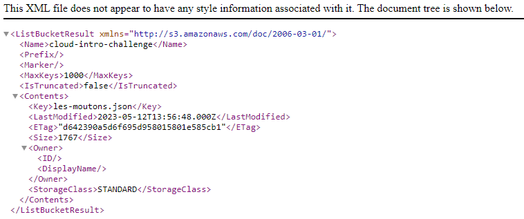

# Le Sot

## Enoncé
Dans un coin reculé du café est assis Panurge, la mine sombre. Prenant pitié, vous vous donnez pour mission de lui remonter le moral.   
« Que diable vous prend-il aujourd'hui ? Il me semblerait rencontrer le désepoir en personne.   
— Mes moutons se sont échappés. L'un deux a pris la fuite, et les autres l'ont suivi.   
— Comment ? Mais où donc sont-ils allés ?   
— Ils sont partis dans les nuages... »   
Allons, vous avez bon coeur n'est-ce pas ? Allez donc lui retrouver ses moutons.   

- Endpoint S3 : https://s3.gra.io.cloud.ovh.net/   
- Bucket : cloud-intro-challenge   
- Attention, il s'agit d'une vrai infrastructure cloud, le brute-force est particulièrement proscrit    


## Solution

On constate que cette infrastructure cloud est hébergée chez OVH. On cherche sur le site d'OVH comment accéder à un bucket, on tombe sur une [documentation](https://help.ovhcloud.com/csm/fr-public-cloud-storage-s3-location?id=kb_article_view&sysparm_article=KB0047389) qui nous explique qu'il suffit d'effectuer une requête à l'adresse `https://my-bucket.s3.gra.perf.cloud.ovh.net` pour accéder au bucket.

<p align="center"></p>

À l'intérieur du bucket, on trouve un fichier XML. Après une lecture attentive, nous remarquons la mention d'un fichier nommé "les-moutons.json". Nous tentons d'y accéder en effectuant une requête à l'adresse `https://cloud-intro-challenge.s3.gra.io.cloud.ovh.net/les-moutons.json`. Et bingo, on accéder au fichier JSON dans lequel se trouve le flag.

## Flag

<details>
<summary> Flag 🚩</summary>

```
404CTF{D35_m0utOns_D4n5_13s_NU@g3s}
```

