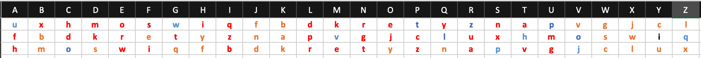

# L'énigme du mal-aimé

**Difficulté** : Moyen

## Enoncé

Le café littéraire est un endroit très mystérieux, dans lequel moult personnes d'horizon divers et variés se rencontrent, dans lequel le temps n'existe pas vraiment. Si ces petits paradoxes temporels ne vous dérangeant guère, il n'en est pas de même pour tous les participants. C'est entre deux cafés crème que Apollinaire vous aborde. Ce dernier a le regard hagard, sa tête envelopée dans d'épais bandages, et vous tint à peu près ce language

Ho, que vous me semblez intelligent !   
La seconde guerre a fait des ravages,   
Mais de valeureux anglais ont limité ce carnage.   
A la fin de la première j'ai gis mourant   

Je vous en conjure, aidez-moi !   
Apaisez mon esprit !   
Résolvez ce mystère dont je suis épris !   
Que l'on nomme Enigma.   

Une lettre a été envoyée au président,   
D'un certain Mr Pignon.   
Ce poli mais farceur polisson,   
A chiffré son message audacieusement !   

Après cette prose dont il est plus que fier, Apollinaire vous tend ladite lettre, qui a été adressée au président de la république française.

kjtnzwpu ro caoxbmrta kw df aocgxpbymw suhrdhqxw   
hjekr ru rozzv ljru dw wuhrk feveo   
kr zoueohvoq jemp mftn vh wuhazvpkw tjgz pw xzwrowqprugv udoprbd lgo oypx euowl ehqh gr nypu suoyqu ro xypdb mr jehao ngnhw wpyquw oh so oypx squw ymw vjvzr wajbdr pq ywpuwpxw fmpymbhz wnh eoghhrw mr ru crpx fegvompo kw df zdmp qgwsehhfmdr sox vudfox   
vjgn rvox peuvq xhqg wa xhpe sox muxpox oupykgbox jemp uowl dyrlgqx rox oergzx   
vjgn fztfauzpnrx zfuegtugv mftn phtjvirynr so dwahw srvo chaubehbymw ymw dfrdzhrdw zmpnr h ohw tjgz ph suhrdw oh jemp vjgn caochzrx u caoxbmra um pepwrgwd haqjetyw mr tehao rltjpqhbeg grzjoupopro lgq dypuyrgwzf tehao taugs nzwhpw mr vzfjuzr mr joubar wa kw dzmouvo   
mjth vhqgvoghrh do vw trakrv mr jemp tjpou oohvo lgoxvqjt drp hyhpxpohvox so phzdfqkghywnxw njta rrdrp nroirp em hzdfq xwhywn   
hfa nz wdpwn gw njta chn hyph h sfba xwhywn zr sfgmuh drp sfbzr podfou   
oh zema vjgn uwhjetrtnra mr jex spup oeieuvn oyqph dr idfq drphyhpxpohvoxsophzdfqkghywnxw   
hjamzhdreogv   
ku zqtteg   

 
## Solution

En réalisant une analyse statistique du texte chiffré, on constate que la répartition de la [Fréquence d'apparition des lettres](https://fr.wikipedia.org/wiki/Fr%C3%A9quence_d%27apparition_des_lettres) est similaire à celle de la langue française. On peut donc émettre l'hypothèse qu'il s'agit d'une forme de chiffrement par substitutions. De plus, en se basant sur les indications fournies dans l'énoncé, on parvient à deviner que la première phrase est "Monsieur le président de la République française" et que la dernière est "Cordialement, Mr Pignon". À partir de là, on tente une substitution monoalphabétique, mais cette approche s'avère infructueuse en raison de conflits rencontrés avec certaines lettres. Par conséquent, on envisage un chiffrement par substitution polyalphabétique. 

<p align="center"></p>

On découvre ainsi que pour coder la première lettre, on se réfère à la première ligne de la clé (e devient o), pour la deuxième lettre, on utilise la deuxième ligne de la clé (e devient r), et pour la troisième lettre, on se réfère à la troisième ligne de la clé (e devient w). À partir de la quatrième lettre, on retourne à la clé de chiffrement initiale (e devient o).


## Flag

<details>
<summary> Flag 🚩</summary>

```
404CTF{leschaussettesdelarchiduchesse}
```

