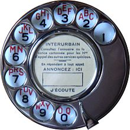

# Désirée Dubois

## Enoncé

L'ambiance est plus calme au Procope. Vous errez sans réel but à travers ses majestueuses galeries parsemées d'œuvres particulièrement élégantes, mais dont vous ne saurez définir l'origine.
L'esprit en partie embrumé par l'ennui, votre attention est soudain captée par un groupe de deux individus autour d'un téléphone. Ces derniers semblent bien agités et sont particulièrement divertissants à écouter.

Vous trouverez en pièce-jointe l'enregistrement de cette conversation digne des plus grandes pièces de théâtre... Clairement, la personne au bout du fil est victime d'un mauvais coup. Il faudrait la prévenir.

> Format : 404CTF{leflaglevraileseull'unique....ouiouivousavezbienentendu:c'estleflag.vousnepouvezpaslerater!}

## Solution

Une fois l’énoncé lu attentivement, on télécharge le mp3, que l’on écoute attentivement. Dès la première écoute, un élément attire l’oreille: la composition du numéro sur un ancien
téléphone à cadran. De plus dans l’énoncé, il est question de “prévenir” la personne qui est victime du mauvais coup. Ce qui pourrait voulori dire qu'on doit l’appeler.

On ouvre le mp3 sur Audacity, et on isole la partie qui nous intéresse. En Ecoutant et en regardant ce signal, on identifie bien 10 zones similaires, correspondant à la composition de
10 chiffres, soit un numéro de téléphone.

<p align="center"></p>

Étant donné que nous sommes en présence d'un téléphone à cadran, la durée nécessaire au retour du cadran à sa position initiale varie en fonction du numéro composé. Cette particularité devrait nous permettre de déterminer le numéro composé. On procéde donc à la mesure du temps requis pour que le cadran revienne à sa position d'origine. Les valeurs obtenues sont les suivantes :    
> 1 : 3.8-2.229 → 1.6   
> 2 : 5.850-4.934 → 0.9   
> 3 : 7.784-6.789 → 1   
> 4 : 10.137-8.769 → 1.368   
> 5 : 11.557 - 10.977 → 0.58    
> 6 : 14.335-12.647 → 1.65   
> 7 : 16.232-15.196 → 1.03   
> 8 : 17.735-17.05 → 0.68   
> 9 : 19.694-18.715 → 0.97   
> 10 : 21.539 -20.627 →0.912   

On peut commencer par émettre une hypothèse importante et non idiote: le premier numéro composé doit être un zéro. Si on regarde le cadran, on s’aperçoit que le zero est le chiffre qui doit prendre le plus de temps à revenir dans sa position. En écoutant, le premier retour est long, l’hypothèse semble pertinente.

On calcule alors une approximation de l'écart de temps entre chaque numéro : 1.6/13 = 0.123   
On en déduit une approximation temporelle de chaque numéro:   
> 0 : 1.6   
> 1 : 0.492   
> 2 : 0.615   
> 3 : 0.738   
> 4 : 0.8615   
> 5 : 0.9846   
> 6 : 1.107   
> 7 : 1.23   
> 8 : 1.3538   
> 9 : 1.4769   

On obtiens alors comme numéro de téléphone: 04 58 10 52 54   
On appelle et on tombe sur un répondeur qui nous donne le flag.

## Flag

<details>
<summary> Flag 🚩</summary>

```
404CTF{justeleflag}
```