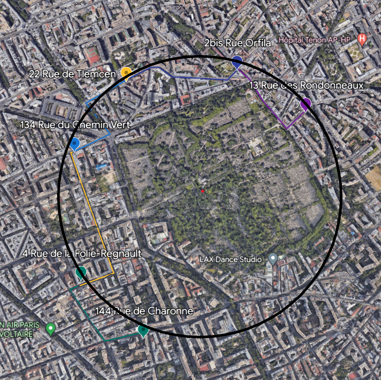

# Un Vol ?

**Difficulté** : Facile

## Enoncé

Vous êtes tranquillement assis dans le café litteraire, quand quelqu'un s'approche de vous et commence à vous parler :

« Connaissez vous l'histoire d'Arsène Lupin ? Non ? Et bien remédions à cela. Arsène Lupin est un gentleman cambrioleur. Il est très doué dans son domaine, en particulier dans l'art du déguisement et de l'usurpation d'identité. C'est grâce à ses nombreux talents qu'il a réussis certains des plus grands casses n'ayant jamais vu le jour : il a notamment récupéré la dalle des rois de Bohême ou encore escroqué le crédit lyonnais. Cependant, un mystère demeure : **où cache-t-il ses butins ?**

Sachez que récemment, Arsène Lupin a été aperçu et pris en filature... Je n'ai malheureusement pas le temps de me pencher sur cette affaire, mais peut-être que vous, vous pourrez trouver le lieu où il cache ses trésors. »

> Format : 404CTF{lieu_de_cachette}. Si la cachette est l'école Jean-Moulin, le flag sera 404CTF{ecole_jean_moulin}


## Solution

On nous fournit les six photos, sur lesquelles on peut voir des noms de rues ou d'établissements, ce qui nous permet de retrouver facilement les adresses de ces lieux sur Google Maps. Les adresses obtenues sont les suivantes :

Photo 1 : 2 bis Rue Orfila, Paris, France   
Photo 2 : 22 Rue de Tlemcen, Paris, France   
Photo 3 : 13 Rue des Rondonneaux, 75020 Paris, France   
Photo 4 : 134 Rue du Chemin Vert, 75011 Paris, France   
Photo 5 : 4 Rue de la Folie-Regnault, 75011 Paris, France   
Photo 6 : 144 Rue de Charonne, 75011 Paris, France   

En plaçant ces points sur une carte, nous constatons qu'ils forment un demi-cercle autour du cimetière du Père Lachaise. Nous traçons alors un cercle passant par tous les points, et la cachette d'Arsène Lupin se trouve au centre de ce cercle.

<p align="center"></p>

## Flag

<details>
<summary> Flag 🚩</summary>

```
404CTF{tombe_de_frederic_chopin}
```