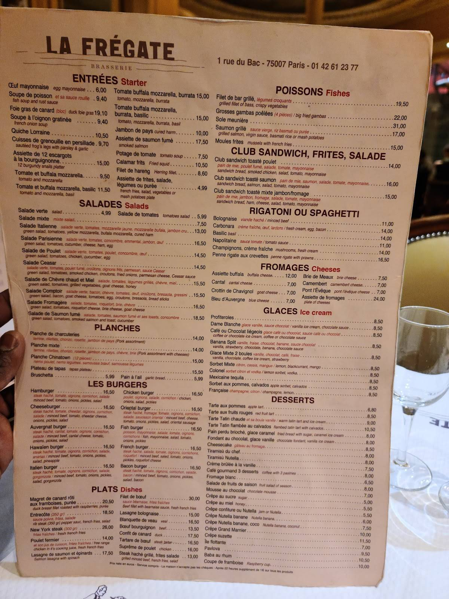

# Mentions Gastronomiques

## Enoncé


## Solution

Après quelques recherches sur les plus gros réseaux sociaux, on trouve rapidement le compte de Margot Paquet sur Instagram dont les posts datent de juste avant le début du CTF https://www.instagram.com/margot.paquet/tagged/.

On peut voir sur son profil 7 photos de plats postées à des dates différentes et on voit qu'elle a été mentionnée par le compte https://www.instagram.com/futurionix/. Sur le compte Futurionix, on apprend que le diner avec Margot a eu lieu le 26 avril juste devant cette photo:

<p align="center"></p>

On peut reconnaitre le Louvres et on peut retrouver sur Google Maps le restaurant "La Frégate" qui se trouve en face, il ne nous reste plus qu'à trouver le prix du repas.

En analysant en détail les descriptions des photos du compte Instagram de Margot, on peut voir que le 27 elle dit avoir mangé une tarte tatin le jour d'avant et parmi le reste des photos du 26 avril, elle précise que le boeuf bourguignon est son "go to au restaurant quand il est à moins de 15€".

Le menu sur le site [The Fork](https://www.thefork.fr/restaurant/la-fregate-r2064/menu) décrit le boeuf bourguignon à plus de 15 euros ce qui implique qu'il faut trouver une version plus ancienne du menu. En cherchant un peu sur internet on peut retrouver des photo d'une carte du restaurant sur la quel on a bien le boeuf bourguignon à moins de 15 euros.  

<p align="center"></p>

On additionner les prix de la tarte tatin + boeuf bourguignon pour trouver la somme finale.

## Flag

<details>
<summary> Flag 🚩</summary>

```
404CTF{22.50}
```