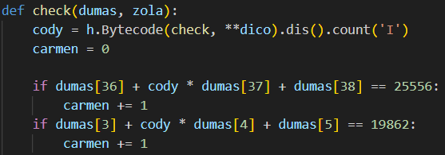

# Encore une mise à jour !

**Difficulté** : Facile

## Enoncé

« RAAAAAAH !! »

Un cri sourd se fait entendre près du comptoir. Vous vous approchez, curieux. Vous remarquez le propriétaire des lieux fou de rage.

« Encore cette satanée Terreur des Quincailliers, il a volé tout mon café ! Je vais devoir appeler l'inspecteur Blognard. Mais comment diable a-t-il fait ?
Vous ! Là ! Vous êtes la personne qui avez aidé les Hackademitiens toute la journée non ? »

Il vous pointe du doigt.

« Et bien ça tombe parfaitement, j'ai un mystère sur les bras, depuis que j'ai mis à jour mon coffre fort, tout mon café disparait régulièrement ! Je suis convaincu qu'il s'agit d'un des nombreux méfaits de cette fameuse Terreur des Quincailliers, mais l'inspecteur refuse de me croire ! Vous voulez bien me prouver que c'est possible de trouver le mot de passe ? D'ailleurs le vendeur m'avait juré qu'il était inviolable ! Si vous arrivez à prouver le contraire, je vais enfin pouvoir porter plainte !»

Pour ce challenge il suffit de trouver le mot de passe qui valide le programme. Attention cepenndant, il ne fonctionne que avec Python 3.11.

> Format : 404CTF{mot de passe}


## Solution

On analyse le fonctionnement du programme `encore-une-mise-a-jour.py`, qui est une ressource du challenge. Après une première lecture du programme, on constate que le mot de passe doit être composé de 48 caractères :

<p align="center"></p>

Ensuite, une fonction `check` est appelée, où l'on trouve un ensemble de 64 équations pour des triplets de lettres du mot de passe. À première vue, il semble y avoir un excès d'équations par rapport au nombre de caractères inconnus (64 équations pour 48 caractères inconnus).

<p align="center"></p>

Mais en examinant plus en détail, on constate qu'il suffit que le mot de passe respecte au moins 32 des équations, ce qui est cohérent lorsque l'on remarque que deux équations identiques doivent donner des résultats différents pour la même paire de triplets, ce qui est impossible. Le mot de passe peut donc satisfaire au maximum la moitié des équations, soit 32 équations.  De plus, il est à noter que chaque triplet de lettres est impliqué exactement dans deux équations distinctes. Enfin, il est important de souligner que les solutions de ces équations doivent être des entiers.

<p align="center"></p>

Tous ces critères font que l'on a une solution unique pour chaque triplet de lettre. La résolution est implémentée dans `solve.py`.


## Flag

<details>
<summary> Flag 🚩</summary>

```
404CTF{H!Dd&N-v4r$_f0r_5p3ciaLiz3d_0pCoD3S!|12T5Y22EML8}
```
