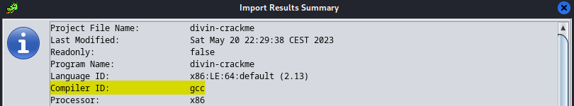

# Le Divin Crackme

**Difficulté** : Introduction

## Enoncé

Jean-Jacques Rousseau vous prend à part : « J'ai déjà raconté la fois où j'ai rencontré le Marquis de Sade ? Non ? Tu en as de la chance... Mes amis avaient plannifié une entrevue entre lui et moi en ville. Avant même de lui parler, il me paraissait étrange. Quoique l'air bien à l'aise, les premiers mots qu'il prononça furent 'Me feriez vous le plaisir de jouer en ma compagnie ?'. Malgré sa demande, j'avais comme l'impression de ne pas vraiment avoir le choix et, en effet, avant de pouvoir lui répondre il poursuivit 'Voici ce que nous allons entreprendre : Vous trouvez mon mot de passe et vous voilà libre. Autrement, je ne réponds plus de rien.'.

Tandis que je m'essayais à son drôle jeu, il me présentait ses points de vue sur les institutions, et, bien que je partage ses opinions sur la nécessité d'accepter l'humain le plus naturel, laissant la corruption des mœurs installée par les institutions derrière nous, je restais critique face à ses aspects les plus libertins... »

« Il serait malvenu de te raconter ce qui se passa par la suite considérant mon échec, mais je suis curieux, aurait tu réussi, toi ? Essaye donc, tu ne risques rien en ce qu'il te concerne ! Pour vérifier que tu ne m'as pas répondu au hasard, j'aimerais que tu me précises avec quel programme le binaire a été compilé ainsi que la fonction spécifique qui est utilisée pour tester le mot de passe. »

> Format : 404CTF{compilateur:fonction:mot_de_passe} | tout en minuscules sauf le mot de passe


## Solution

Pour ce challenge d'introduction au reverse, nous devons retrouver trois informations :  
- le compilateur qui a servi lors de la création du programme  
- la fonction permettant de vérifier le mot de passe  
- le mot de passe.

Pour la première partie, il suffisait d'importer le fichier dans un décompileur tel que Ghidra. Dans la fenêtre d'informations, nous voyons toutes les infos concernant le fichier, dont le "Compilator ID" : 

<p align="center"></p>

Le compilateur est donc **GCC**. Maintenant, nous allons passer à l'analyse du programme divin-crackme. Pour ce faire, on commence par analyser la fonction main : 

<p align="center"></p>

Dans le code, on trouve les informations qui nous manquent :
- Le mot de passe est vérifié à l'aide de la fonction **strncmp** (string compare).
- Le mot de passe est décomposé en 3 partie qui mis bout à bout donne **L4_pH1l0soPh13_d4N5_l3_Cr4cKm3**.

On a désormais toutes les informations demandées.

## Flag

<details>
<summary> Flag 🚩</summary>

```
404CTF{gcc:strncmp:L4_pH1l0soPh13_d4N5_l3_Cr4cKm3}
```
