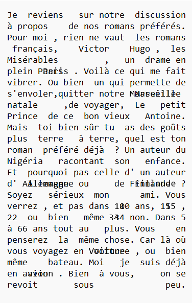

# En Profondeur

**Difficulté** : Moyen

## Enoncé

Alors que vous dégustiez une assiette d'oeufs mayo, un homme fait son apparition dans Le Procope. Il prend place à côté de vous et se présente comme étant Monsieur de Valmont. Il vous raconte avoir reçu une lettre étonnante de Madame de Merteuil. Après quelques temps passé à discuter, il vous confie que celle-ci avait accepté un rendez-vous avec lui suite à un pari gagné. Il doutait franchement qu'elle honore sa parole, d'autant qu'elle voyage beaucoup et qu'il n'a pas le permis b lui permettant de la rejoindre n'importe où. Il s'interroge néanmoins sur cette lettre. Pouvez-vous aider de Valmont à voir le message caché derrière celle-ci ?

> Format : 404CTF{message_caché_chaque_mot_en_minuscule}


## Solution

On nous donne le texte suivant :

<p align="center"></p>

Le principe utilisé repose sur les [autostéréogrammes](https://fr.wikipedia.org/wiki/Autost%C3%A9r%C3%A9ogramme). Le créateur du challenge a donc appliqué ce principe au texte (stéréogramme ASCII). Il faut donc superposer le texte de droite et de gauche, puis d'observer les mots qui ressortent. En effet, les deux textes sont quasiment identique, mais quelques espaces ne sont pas exactement au même endroit à droite et à gauche. Ainsi, si on superpose les deux textes, tous les mots se superposent parfaitement sauf quelques mots. Ces mots forment le message recherché.

Voile ce que ca donne :
<p align="center"></p>

On peut distinguer deux messages différents en classant les mots en fonction de leur décalage vers la droite ou vers la gauche dans le texte de droite par rapport au mot du texte de gauche. Cela donne les deux messages suivants :
- Paris Finlande 15 6 avion
- Marseille Allemagne 10 34 voiture

Le flag est donc l'un des deux messages.

## Flag

<details>
<summary> Flag 🚩</summary>

```
404CTF{paris_finlande_15_6_avion}
```


