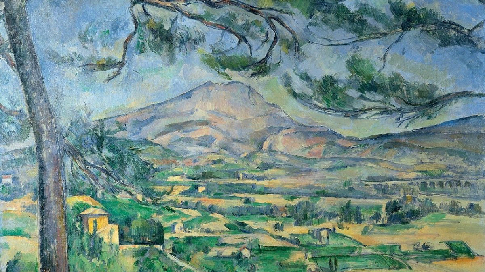
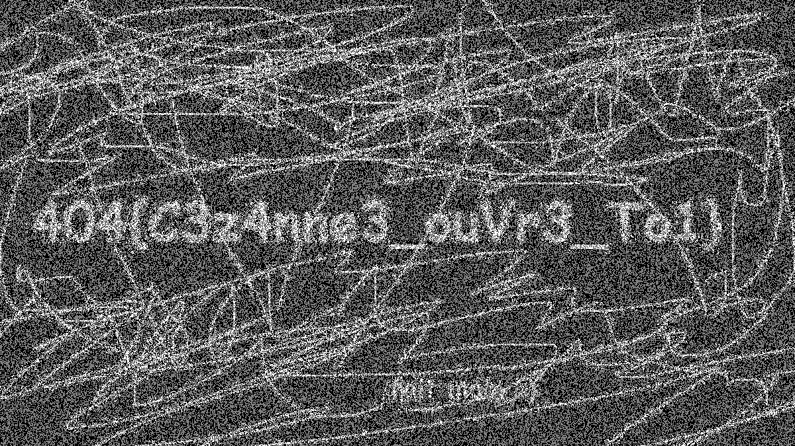

# L'oeuvre

**Difficulté** : Facile

## Enoncé

Dans un coin du Procope, vous remarquez Claude Lantier scrutant sans relâche un tableau, tasse à la main. Cette situation vous interpelle et vous lui demandez ses raisons . Il vous explique qu'avec son œil de peintre il remarque des variations de couleurs à la limite de l'imperceptible.

## Solution

On nous donne une image :

<p align="center"></p>

L'énoncé parle "variations de couleurs à la limite de l'imperceptible" ce qui peut laisser penser que le mot de passe est caché dans les bits de poids faible de l'image. On utilise l'outil [Stegonline](https://stegonline.georgeom.net/upload) ou [Aperisolve](https://www.aperisolve.com/) pour garder les deux bit de poids faible. On trouve alors l'image suivante :

<p align="center"></p>


## Flag

<details>
<summary> Flag 🚩</summary>

```
404{C3z4nne3_ouVr3_To1}
```
