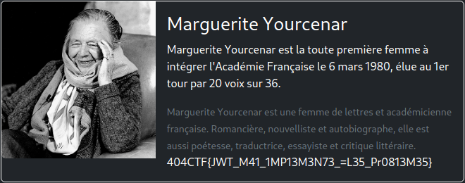

# L'Académie du détail

**Difficulté** : Facile

## Enoncé

Le nez plongé dans votre café noir, vous parcourez d'un rapide coup d'œil la une du journal fraichement paru. L'un des titres vous interpelle :

> **Mars 1980 : L'opaque secret du nouveau membre de l'Académie Française.**

Vous parcourez alors le journal à la recherche de l'article en question. Il énonce :

> Après des heures de délibération, les Académiciens ont enfin voté pour le nouveau membre de la grande Académie Française. Mais pour des raisons que tout le monde ignore, son nom demeure secret depuis ce jour. Malgré tous leurs efforts, aucun journaliste n'a réussi a obtenir le moindre indice ou la moindre image.

Interloqué, vous vous rendez compte que l'Académie Française possède un site web. Peut être que la réponse est finalement à portée de tous, voir **même plus** ... !

Toutes les informations nécéssaires à la résolution de ce challenge sont présentes dans l'énoncé ci-dessus. Le flag est au format classique 404CTF{}. Vous devez le trouver, il ne peut pas être deviné.

> <p align="center"> https://academie.challenges.404ctf.fr/ </p>


## Solution

Pour ce challenge de web, nous arrivons sur une page d'accueil avec un carrousel, beaucoup de mots et un espace de connexion. On peut dans un premier temps regarder le code source de la page mais rien d'intéressant à l'intérieur. La partie qui peut être très intéréssante est celle de la page de connexion :  

<p align="center"></p>

Pour ce connecter, il faut un nom d'utilisateur et un mot de passe (logique). On essaye tout de suite le couple admin/amin pour voir si l'administrateur du site ne serait pas trop bête.
Résultat : 

<p align="center"></p>

On teste avec d'autre mot de passe mais on à toujours la même erreur. Passons à un autre utilisateur comme test,user ou pseudo. Quand nous testons, peu importe le mot de passe donné, nous parvenons à nous connecter : 

<p align="center"></p>

Une nouvelle page a été débloquée : "Liste des membres". Si nous souhaitons y accéder, voici le résultat que nous avons : 

<p align="center"></p>

Le résultat n'est toujours pas convaincant... Mais maintenant on sait que l'on doit trouver un moyen de se connecter au compte admin pour accéder à la page "Liste des Membres". En regardant le code, on voit qu'en se connectant, on récupère un cookie de connexion plus précisément un JWT Token. En allant sur [jwt.io](https://jwt.io/) et en mettant le token récupéré, nous pouvons voir les infos remplies lors de l'envoi du formulaire de connexion : 

<p align="center"></p>

En regardant les différentes vulnérabilités des tokens JWT, on trouve une attaque du nom de "none token signature" qui consiste à passer l'algorithme à null dans le header. C'est ce qu'on va faire à l'aide du site https://www.gavinjl.me/edit-jwt-online-alg-none/ et on vas en même temps changer le username en admin. On remplace alors la valeur du token actuel par celle du nouveau token. On essayer d'accéder à la page "Liste des Membres" et ça marche !

<p align="center"></p>


## Flag

<details>
<summary> Flag 🚩</summary>

```
404CTF{JWT_M41_1MP13M3N73_=L35_Pr0813M35}
```