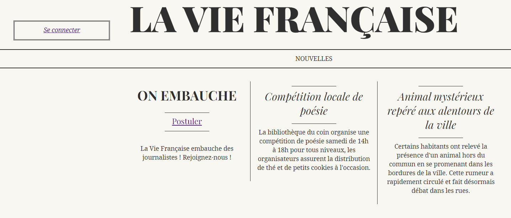
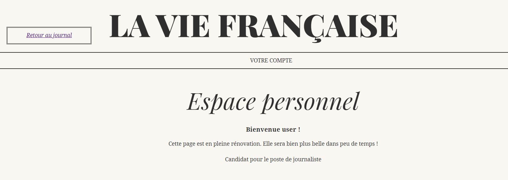

# La Vie Française

**Difficulté** : Facile

## Enoncé

Assise dans un coin du café, Madelaine Forestier observe, seule, les clients s'agiter. Depuis votre place, vous l'apercevez. C'est une femme digne, intelligente et ambitieuse, cela se lit dans son attitude. Mme. Forestier est veuve, c'est une de vos rencontres précédentes au comptoir qui vous l'a dit. Charles Forestier, journaliste du célèbre La Vie Française est décédé il y a peu. Problèmes de santé, semblait-il.

Vous voyez un homme s'approcher de Mme. Forestier.

« C'est Georges Duroy, vous souffle-t-on à l'oreille, un ami de Forestier qui n'a pas perdu le Nord ! Depuis la mort de ce pauvre Charles, Duroy cherche à séduire Madelaine pour récupérer ses parts dans le journal. »

Vous n'écoutez pas plus longtemps. Alors que Mme. Forestier semble refuser avec lassitude la demande que vient de faire ce M. Duroy, vous avez remarqué que ce dernier regardait avec attention le journal qu'elle venait de finir de lire. Duroy part en hâte ; il abandonne bien trop vite pour que cela soit normal...

Vous récupérez le journal de Mme. Forestier. Analysez-le : si Georges Duroy est parti aussi vite, c'est qu'il a trouvé un moyen d'accéder aux parts qu'il convoite tant.

Rappel : L'utilisation de tout outil de bruteforce, dont sqlmap, est interdite.

> <p align="center"> https://la-vie-francaise.challenges.404ctf.fr/ </p>


## Solution

Etant donner que dans l'énoncer on parle d'outil comme sqlmap on peut se douter qu'il vas probablement falloir faire une injection SQL.

Pour ce challenge, nous arrivons sur une page avec un lien pour postuler (s'inscrire) ou pour se connecter : 

<p align="center"></p>

Dans un premier temps, nous pouvons tester de nous inscrire pour voir ce qu'il est possible d'avoir. On peut tenter de s'inscrire avec le pseudo admin, mais il y a un message d'erreur. On tente également des injections SQL mais on a rien de probant. On va donc simplement créer un compte user.

<p align="center"></p>

On passe maintenant à la page de connexion. On essaye à nouveau le pseudo admin ou des injection SQL, mais toujours rien. On va donc simplement de connecter avec l'utilisateur que l'on a créé.

<p align="center"></p>

On arrive alors sur un espace personnel avec rien de particulier a premiere vue, on a juste un lien vers la page d'acceuil.

<p align="center"></p>


## Flag

<details>
<summary> Flag 🚩</summary>

```
404CTF{B3w4Re_th3_d3STruct1v3s_Qu0tes}
```
