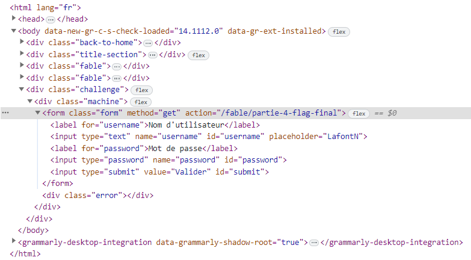

# Le Loup et le renard

**Difficulté** : Facile

## Enoncé

Dans un coin du café, un homme est assis. Une tasse de café ainsi qu'un manuscrit sont posés devant lui. Il observe la salle : les allées-venues des clients, les conversations. Il semble à l'affût de la moindre action, du moindre écart de la part de son sujet d'observation.

Alors que son regard parcourt la salle, il s'étonne de voir que vous l'observiez déjà. D'un geste accompagné d'un sourire il vous invite à le rejoindre.

« Bienvenue ! Prenez place. Il est rare de voir quelqu'un d'attentif à autre chose que sa propre personne ici. C'est dommage, c'est justement ce qu'il y a de plus intéréssant dans ce genre de rassemblement : les autres. Je me présente : Jean de La Fontaine. Votre regard me plait, vous me semblez capable de m'aider sur mon prochain manuscrit. J'écris, voyez-vous ? Des fables, je m'inspire de ce que je vois et j'observe. Pouvez-vous m'aider à écrire la suite de celle-ci ? »

Ouvrez l'oeil et trouvez la fin de cette fable.
 
> <p align="center"> https://le-loup-et-le-renard.challenges.404ctf.fr/</p>

## Solution

En cliquant sur le [lien](https://le-loup-et-le-renard.challenges.404ctf.fr/) fourni dans l'énoncé, on est redirigé vers une page d'accueil où l'on trouve un bouton "Démarrer". On clique dessus et on est ensuite dirigé vers une [nouvelle page](https://le-loup-et-le-renard.challenges.404ctf.fr/fable/partie-1-inspecteur) intitulée "Partie 1 Authentification". Ce titre laisse entendre qu'il sera nécessaire de réussir une authentification. En examinant le code de la page, on trouve rapidement dans le code JavaScript le login et le mot de passe valides.

<p align="center"></p>

On entre le login mot de passe et on est redirigé vers une [seconde page](https://le-loup-et-le-renard.challenges.404ctf.fr/fable/partie-2-cookie) intitulée "Partie 2 cookies". Ce titre nous laisse entendre qu'il sera nécessaire d'allé voir du coter des cookie. On voit alors qu'il y a un cookie nommé admin dont la valeur est à False.

<p align="center"></p>

On passe la valeur de False à True, on recharge la page et on arrive alors sur une [troisiéme page](https://le-loup-et-le-renard.challenges.404ctf.fr/fable/partie-3-redirect) intitulée "Partie 3 Redirect". En regardant dans le code, on trouve dans le javasript l'adresse de la 4éme page `/fable/partie-4-flag-final`.

<p align="center"></p>

On faire une requête sur cette adresse et on arrive alors brièvement sur la [dernière page](https://le-loup-et-le-renard.challenges.404ctf.fr/fable/partie-4-flag-final) avant d'être rediriger sur la 3éme par celle-ci. On utilise donc un outil comme [Burb](https://portswigger.net/burp) qui enregistre les pages visitées. On trouve alors le flag sur cette dernière page.

<p align="center"></p>

## Flag

<details>
<summary> Flag 🚩</summary>

```
404CTF{N0_frOn1_3nD_auTh3nt1ficAti0n}
```

