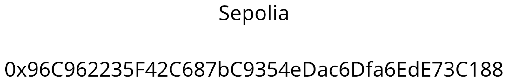

# L'Antiquaire, tête en l'air

**Difficulté** : Facile

## Enoncé

Disclaimer : Vous ne devez, en aucun cas, utiliser vos fonds personnels pour résoudre les challenges de web3. Il n'est pas nécessaire de posséder des cryptomonnaies pour lancer les challenges, intéragir avec ou les valider. (Il est aussi inutile de soudoyer les concepteurs des challenges) Cordialement -La trésorerie

Alors que votre esprit se laissait aller à différentes considérations, une scène étrange capta votre attention. Un vieil homme, agitant frénétiquement ses membres sur une chaise, arborait une expression anxieuse. Emu, vous vous enquîtes de son état, et il se confia à vous, révélant sa profession d'antiquaire et la perte du mot de passe pour accéder à l'un de ses coffres-forts, abritant des antiquités de valeur.

D'un coeur compatissant, vous décidâtes de l'accompagner dans sa boutique pour tenter de retrouver le précieux sésame. Le vieil homme mentionna alors l'existence d'un mémorandum, rédigé il y a de cela quelques années, qui pourrait lui être d'une grande aide en pareille circonstance. Mais, en proie à une certaine confusion, il ne savait plus comment en faire usage. Ainsi vous chargea-t-il de la mission de trouver le mot de passe grâce à ce mémorandum. En guise de remerciement, il vous offrirait la magnifique peau de chagrin ornementant le mur.

Que faîtes-vous donc ?


## Solution

On doit trouver le mot de passe de l'antiquaire. On a comme ressource un fichier memorandum.txt. Ce fichier est un Memo. Un mémo est un court message ou une description qui est attaché à une transaction ou à une interaction sur un réseau blockchain. Lorsque vous effectuez une transaction sur un réseau blockchain, comme l'envoi de jetons de crypto-monnaie d'une adresse à une autre, vous pouvez avoir la possibilité d'inclure un mémo. Le mémo est un champ facultatif dans lequel vous pouvez inclure des informations supplémentaires sur la transaction.

Le mémo est en format hexadécimal. En le décodant, on découvre deux éléments à la fin :
- Une URL `https://shorturl.ac/mysecretpassword` qui conduit à un Rick Roll.
- Un endpoint `/ipfs/bafybeia5g2umnaq5x5bt5drt2jodpsvfiauv5mowjv6mu7q5tmqufmo47i/metadata.json`.

En cherchant sur le internet, on apprend que l'IPFS (InterPlanetary File System) est un système de fichiers distribués peer-to-peer conçu pour créer une infrastructure web plus décentralisée et plus résistante. Il s'agit d'un protocole qui permet de stocker et de récupérer des fichiers sans dépendre des serveurs centralisés traditionnels.
On trouve comment l'utiliser sur ce site : https://decrypt.co/resources/how-to-use-ipfs-the-backbone-of-web3

On cherche notre endpoint sur ipfs.io :
https://ipfs.io/ipfs/bafybeia5g2umnaq5x5bt5drt2jodpsvfiauv5mowjv6mu7q5tmqufmo47i/metadata.json

On tombe sur un fichier JSON :
<p align="center"></p>

Dans ce Json, on trouve un autre endpoint également présent sur ipfs.io :
https://ipfs.io/ipfs/bafybeic6ea7qi5ctdp6s6msddd7hwuic3boumwknrirlakftr2yrgnfiga/mystere.png

On tombe sur une image :
<p align="center"></p>

On voit sur cette image ce qui peut ressembler une adresse de contrat sur une blockchain. On trouve sur Internet que Sepolia est une blockchain. On cherche le contrat que l'on a trouver sur  https://sepolia.etherscan.io/.  On y trouve le contrat et dans la partie "Constructor Arguments" il y a le flag.
<p align="center"></p>


## Flag

<details>
<summary> Flag 🚩</summary>

```
404CTF{M3M3_P45_13_73MP5_D3_53CH4UFF3r_QU3_C357_D3J4_F1N1!}
```
